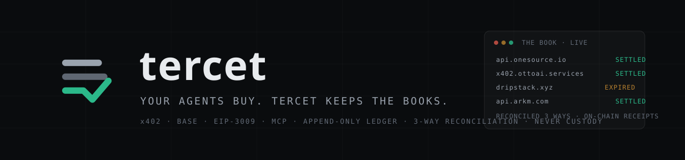

<p align="center"></p>

<p align="center">
  <a href="https://github.com/BenyFridY/tercet/actions/workflows/ci.yml"></a>
  
  
  
</p>

# tercet

**The book of record for machine payments.** Every agent purchase is recorded as it
happens (request → quote → signed authorization), matched against on-chain
settlement, and **every difference gets a name** — delivered-but-uncollected,
paid-without-delivery, replay, chain-orphan. tercet never touches keys, balances or
the payment path: it observes and produces evidence.

> *A tercet is a stanza of three lines that belong together — here, every purchase
> is one: the request, the authorization, the settlement. Dante chained his tercets
> so none could be pulled out without breaking the poem; this ledger chains its
> entries the same way.*

The Python package is still named `mesa` (working name); it renames to `tercet`
with the first PyPI release. Project docs under `docs/` are written in Portuguese —
they are the build diary and per-phase design docs; code, schemas and this README
are English.

## The app — the ledger, live, in six screens

```powershell
uv run mesa-app        # -> http://127.0.0.1:8400
```

**01 blotter** (what your agents bought, with derived state and the event chain of
each purchase) · **02 tca** (waste, dedup across agents, cost per delivered result)
· **03 risk** (budget per task tree, human approvals, the payer passport) ·
**04 lab** (point-in-time spend-policy backtest with honest confidence intervals) ·
**05 books** (three-way reconciliation, sealed periods with two third-party
timestamps, per-counterparty statement, BR tax view) · **06 operations** (run the
audited engines from the screen — demo, collectors, exports — testnet only).

The app is **read-only by construction**: its Postgres session opens with
`default_transaction_read_only=on`, so it cannot write to the ledger even if it
wanted to — and `tests/test_app.py` proves it. Real data always; testnet and
synthetic rows are labeled on the screen itself. Press any pill for its legend.

## The MCP server — the ledger as tools for agents

```powershell
claude mcp add tercet -- uv run mesa-mcp    # then ask: "how much did my agents spend?"
```

Seven READ tools (closed list, proven by test): `status_do_livro`, `gasto`,
`compras` (filterable), `compra` (one purchase + its event chain), `vereditos`,
`passaportes`, `fiscal`. Same guarantee as the app: the session is structurally
read-only — the MCP server has no write path; `tests/test_mcp_livro.py` proves it.
Transport: stdio, local.

## The exports — universal accounting + OECD CARF view

```powershell
uv run python scripts/fase13/contabil_build.py   # -> contabil/<yyyy-mm>/  (universal CSV, QuickBooks, Xero + per-tx audit detail)
uv run python scripts/fase13/carf_build.py       # -> fiscal/carf/<year>/  (OECD CARF view, born as OECD11 test data)
```

A double-entry journal per period (debits == credits proven; micro-payments
aggregated honestly, with a 6-decimal audit bridge tying every cent to a tx hash),
and the CARF view — what a reporting crypto-asset service provider would report
about these transactions under the OECD framework (official July 2025 guide) —
labeled as a demo, synthetic identities, real numbers. Details and caveats:
`docs/fase13-export.md`.

## From zero, with only this README

Prerequisites: [uv](https://docs.astral.sh/uv/), Docker, Python 3.11+.

```powershell
# 1. dependencies + database (Postgres 17 on 127.0.0.1:5433 — your machine only)
uv sync
docker run -d --name mesa-pg -e POSTGRES_USER=mesa -e POSTGRES_PASSWORD=mesa `
  -e POSTGRES_DB=mesa -p 127.0.0.1:5433:5432 `
  -v mesa-pgdata:/var/lib/postgresql/data postgres:17
uv run python scripts/check_db.py            # migrations + hash-chain genesis, idempotent

# 2. TEST wallets (written to a local .env; never committed) + faucet USDC
uv run python scripts/setup_wallets.py
#    -> paste the buyer address into https://faucet.circle.com (USDC / Base Sepolia)
uv run python scripts/check_balance.py       # balance read on-chain

# 3. a toy seller + 10 REAL x402 payments on testnet
uv run uvicorn mesa.http.seller:app --port 8402     # terminal 1
uv run python scripts/fase1/buyer.py 10             # terminal 2 (writes the ledger)

# 4. the chain is the source of truth: collect and reconcile
uv run python -m mesa.collector              # matches (authorizer, nonce) with the ledger
uv run python -m mesa.cli                    # the verdict table, orphans in red

# 5. the product
uv run mesa-app                              # -> http://127.0.0.1:8400
```

Costs **zero real money**: faucet USDC, and under the `exact` scheme the
facilitator pays gas.

- **What happened, what it proved, what comes next:** [docs/DIARIO.md](docs/DIARIO.md)
  (Portuguese) — the per-task build diary; per-phase design docs live in `docs/faseN.md`.
- **Secrets** (the private keys `setup_wallets.py` generates) go to a local `.env`
  (gitignored, never committed). To keep them elsewhere, point `MESA_ENV_FILE` at
  the file — and keep it **out** of synced folders (OneDrive/Dropbox): a key in a
  synced folder is a key in the cloud.

## Repo map

| Path | What it is |
|---|---|
| `src/mesa/config.py` | Constants (USDC, network, chain id) + `Settings` read from `.env` |
| `src/mesa/db.py` | Ledger access — **insert-only by construction** |
| `src/mesa/reconcile.py` | **The heart**: three-way reconciliation, pure function |
| `src/mesa/collector.py` | On-chain collector: `Transfer` + `AuthorizationUsed` per txHash; idempotent, persisted cursor |
| `src/mesa/cli.py` | `uv run python -m mesa.cli` — the verdict table, orphans in red |
| `src/mesa/http/` | HTTP rail: toy seller (with chaos modes) + instrumented buyer |
| `src/mesa/mcp/` | MCP: paid-tool rail (seller/buyer) + `livro.py`, the read-only product MCP server |
| `src/mesa/app/` | The web app (FastAPI + Jinja2, server-rendered, read-only session) |
| `src/mesa/passaporte.py` | The payer passport: portable, self-signed settlement history |
| `src/mesa/contabil.py` / `carf.py` / `decripto.py` | The export renderers (accounting / OECD CARF / Brazil) |
| `migrations/` | Numbered plain SQL — schema agnostic to rail and transport |
| `scripts/` | Environment utilities + `faseN/` — the executable proofs of each phase |
| `tests/` | The gates as pytest: dirty data in → expected classification out |
| `docs/` | Build diary + per-phase design docs (Portuguese) |
| `verificador/` | Standalone verifiers — check the ledger and passports **without trusting this repo** |

## Environment

```powershell
uv sync
docker run -d --name mesa-pg -e POSTGRES_USER=mesa -e POSTGRES_PASSWORD=mesa `
  -e POSTGRES_DB=mesa -p 127.0.0.1:5433:5432 `
  -v mesa-pgdata:/var/lib/postgresql/data postgres:17
# 127.0.0.1 is mandatory: without it the ledger is open to any machine on the same
# Wi-Fi (docs/seguranca.md, hole #1). scripts/saude.py checks this, always.
uv run python scripts/setup_wallets.py   # generates the EOAs -> .env (NEVER committed)
uv run python scripts/check_db.py        # Postgres up + migrations + genesis
uv run python scripts/check_balance.py   # USDC balance read on-chain
uv run python scripts/saude.py           # ONE command: ruff+mypy+pytest+verifier+ports+secret scan
uv run python scripts/backup_db.py       # ledger dump -> backups/ (routine, ~5s)
```

Faucet: https://faucet.circle.com → USDC → Base Sepolia (20 USDC / 2h per address).
Anthropic key (only for the invoice-rail agent demo): `ANTHROPIC_API_KEY=...` in
your secrets env file.

## Run the proofs of each phase

```powershell
# Phase 1 — the ledger closes on dirty data
uv run uvicorn mesa.http.seller:app --port 8402     # terminal 1: HTTP seller
uv run python scripts/fase1/chaos_run.py            # terminal 2: chaos + reconciliation + asserts

# Phase 2 — x402 over MCP
uv run python -m mesa.mcp.seller                    # terminal 1: MCP seller (port 8403)
uv run python scripts/fase2/mcp_once.py             # terminal 2: 1 paid tool call + ledger

# Phase 10 — the payer passport (emits, verifies, gates a seller)
uv run python scripts/fase10/gate10_demo.py

# Any time: sweep the chain and reconcile
uv run python -m mesa.collector                      # testnet (seller payTo)
uv run python -m mesa.collector --pagador            # mainnet (payer-side)
uv run python -m mesa.cli
```

## Quality ("done" has a definition)

```powershell
uv run python scripts/saude.py    # ONE command: ruff+mypy+pytest+verifier+ports+secret scan
```

Threat model, and what is out of scope — by name: [docs/seguranca.md](docs/seguranca.md).
